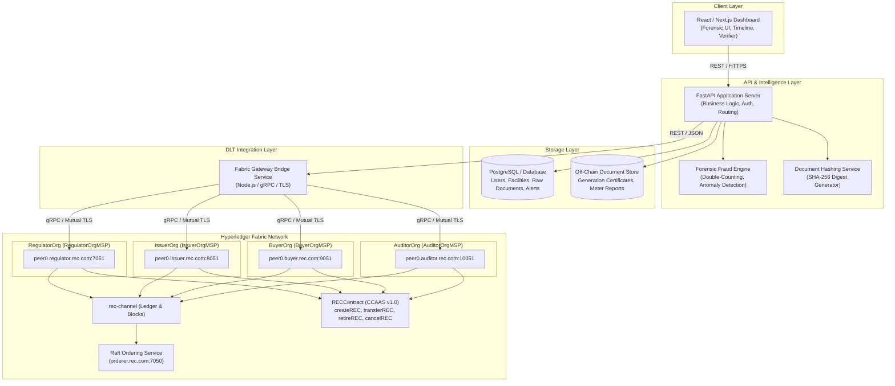
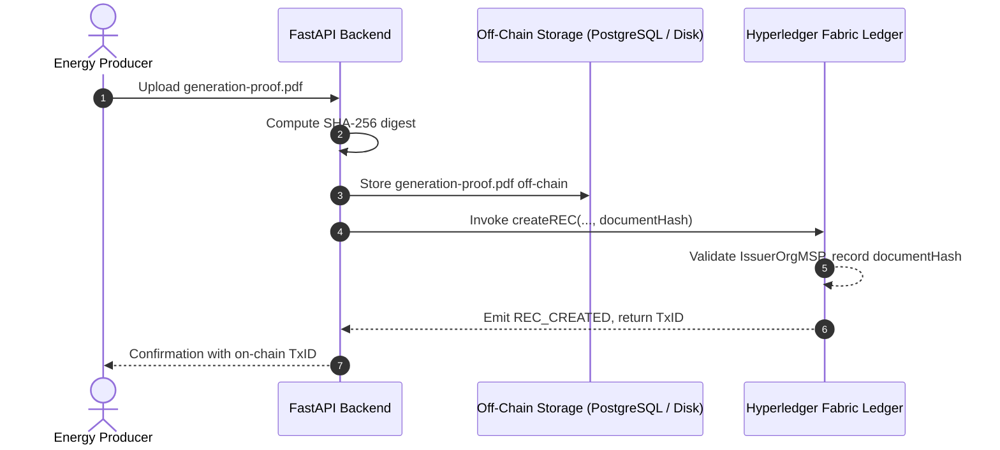

# System Architecture

## Renewable Energy Certificate (REC) Fraud Detection & Tracking System

This document outlines the end-to-end architecture of the REC Fraud Detection & Tracking System, integrating **Hyperledger Fabric v2.5** distributed ledger technology with an off-chain **FastAPI** backend, **PostgreSQL** relational database, and modern **React / Next.js** forensic intelligence frontend.

---

## 1. Architectural Overview

---

## 2. Why Permissioned Blockchain & Why Hyperledger Fabric?

### 2.1 Public vs Permissioned Blockchains
* **Public Blockchains (e.g. Ethereum, Solana)**:
  * Publicly readable by anonymous entities, high and volatile transaction fees (gas), low throughput, and lack of native enterprise privacy partitions.
  * In regulatory and corporate REC trading, market participants must be strictly verified entities (Regulators, Certified Issuing Registries, Verified Corporate Buyers, Accredited Auditors).
* **Permissioned DLT (Hyperledger Fabric)**:
  * **Known Identities**: Every transaction is cryptographically signed using X.509 PKI digital certificates issued by an authorized Certificate Authority.
  * **Deterministic Finality**: Uses Raft crash-fault-tolerant (CFT) ordering without probabilistic forks or proof-of-work/stake mining delays.
  * **Granular MSP Authorization**: Chaincode can directly inspect the caller's Membership Service Provider (MSP) identifier (e.g. `IssuerOrgMSP` vs `BuyerOrgMSP`) to enforce strict separation of duties.
  * **Zero Gas Fees**: High-throughput transaction settlement without transaction gas volatility.

### 2.2 Why Blockchain Instead of Only PostgreSQL?
| Metric / Threat | PostgreSQL Only | Hyperledger Fabric DLT + PostgreSQL |
| :--- | :--- | :--- |
| **Trust Model** | Centralized database administrator has root access and can rewrite rows | Decentralized consensus across 4 independent organizations |
| **Tamper-Evidence** | Logs and records can be altered, truncated, or deleted | Cryptographically chained blocks; immutable audit history |
| **Double Spending / Reuse** | Depends on application-level locks vulnerable to DB replication race conditions | State machine transition enforced by multi-peer majority endorsement |
| **Auditability** | Difficult to prove external tamper-resistance to third-party auditors | Complete chronological transaction key history (`getHistoryForKey`) |

---

## 3. On-Chain vs Off-Chain Data Separation

A foundational principle of enterprise blockchain architecture is **never store large binary documents on the ledger**.

### What Goes On-Chain:
* Certificate identifier (`recId`)
* Generator facility ID (`generatorId`)
* Energy type (`energySource`)
* Generation period date (`generationDate`)
* Generation quantity (`generationMWh`, `issuedQuantity`)
* Current owner & Participant balance map (`balances: { [owner]: quantity }`)
* Active & Retired quantities (`activeQuantity`, `retiredQuantity`)
* Certificate lifecycle status (`ACTIVE`, `RETIRED`, `CANCELLED`)
* **Cryptographic SHA-256 document fingerprint (`documentHash`)**
* State change timestamps and Fabric Transaction IDs

### What Stays Off-Chain:
* Raw PDF reports, meter readings, single-line diagrams, inverter logs
* User passwords, JWT sessions, profile details
* AI / ML model weights and training datasets
* Intermediate fraud scoring calculations and logs
