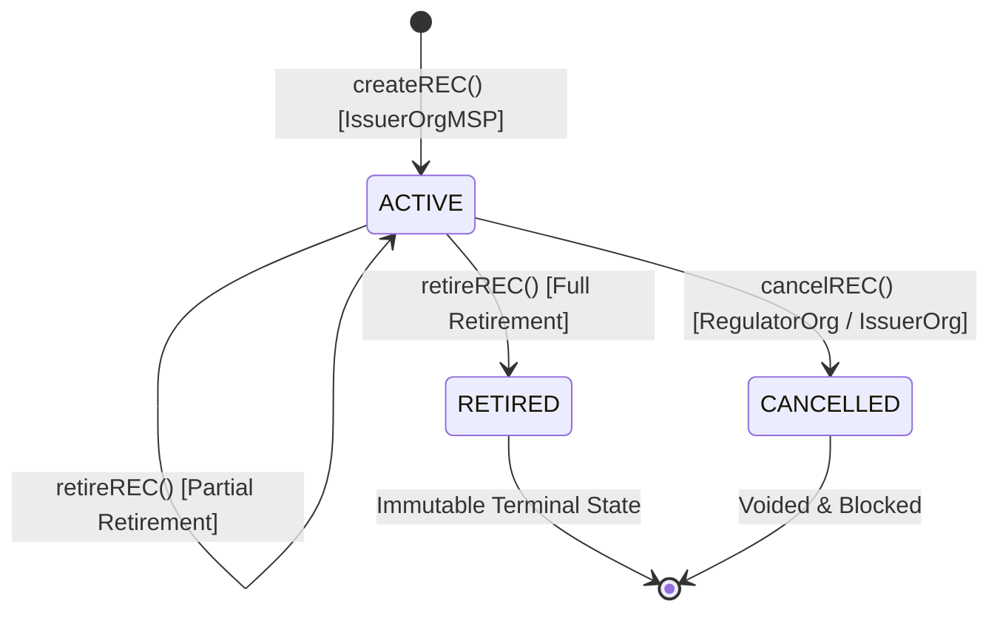

# Hyperledger Fabric Chaincode: RECContract

The smart contract `RECContract` provides deterministic, tamper-evident business logic governing the issuance, trading, retirement, cancellation, and cryptographic auditing of Renewable Energy Certificates.

---

## 1. Smart Contract Architecture

Implemented in **TypeScript** using `fabric-contract-api` v2.5.
Located at: `fabric-network/chaincode/rec-contract/`



---

## 2. Core Functions & Rules

### 2.1 `createREC(...)`
* **Permitted Callers**: `IssuerOrgMSP` only.
* **Pre-conditions**:
  * REC ID must not already exist on ledger.
  * Quantity must be greater than zero.
  * Generation MWh must be greater than zero.
  * Document SHA-256 hash must be exactly 64 hexadecimal characters.
* **State Updates**:
  * Initializes on-chain REC asset with status `ACTIVE`.
  * Allocates initial balance to `ISSUER-ORG`.
* **Ledger Event**: `REC_CREATED`

### 2.2 `transferREC(recId, fromOwner, toOwner, quantity, transactionReference)`
* **Permitted Callers**: Current owner holding the units.
* **Pre-conditions**:
  * Certificate must exist and have status `ACTIVE`.
  * `fromOwner` must have balance $\ge \text{quantity}$.
  * `quantity` must be positive integer.
* **State Updates**:
  * Decrements `fromOwner` sub-balance.
  * Increments `toOwner` sub-balance.
  * Updates `currentOwner` pointer.
* **Ledger Event**: `REC_TRANSFERRED`

### 2.3 `retireREC(recId, owner, quantity, retirementReason)`
* **Permitted Callers**: Certificate holder.
* **Pre-conditions**:
  * Certificate must be `ACTIVE`.
  * `owner` must hold active balance $\ge \text{quantity}$.
  * `quantity` must be positive.
* **State Updates**:
  * `activeQuantity` $\leftarrow$ `activeQuantity` - `quantity`.
  * `retiredQuantity` $\leftarrow$ `retiredQuantity` + `quantity`.
  * If `activeQuantity == 0`, status transitions to `RETIRED`.
* **Guarantee**: Retired certificates can **NEVER** become active again.
* **Ledger Event**: `REC_RETIRED`

### 2.4 `cancelREC(recId, reason)`
* **Permitted Callers**: `RegulatorOrgMSP` or `IssuerOrgMSP`.
* **Pre-conditions**:
  * Certificate must exist.
  * Caller must possess administrative / regulatory authority.
* **State Updates**:
  * Status transitions to `CANCELLED`.
  * All transfers and retirements are permanently blocked.
* **Ledger Event**: `REC_CANCELLED`

### 2.5 `getRECHistory(recId)`
* Calls Fabric's `ctx.stub.getHistoryForKey(recId)`.
* Returns chronological array of all block modification transactions, including transaction IDs, timestamps, mutation payloads, and deletion markers.

### 2.6 `verifyREC(recId)`
* Computes on-chain cryptographic audit of state:
  * Verifies non-cancelled status.
  * Verifies conservation law: $\sum \text{balances} == \text{activeQuantity}$.
  * Verifies global balance: $\text{activeQuantity} + \text{retiredQuantity} == \text{issuedQuantity}$.
  * Verifies presence of registered document SHA-256 fingerprint.

---

## 3. Automated Chaincode Unit Tests

Mocha unit tests in `src/recContract.spec.ts` validate all 16 business logic conditions:
```bash
cd fabric-network/chaincode/rec-contract
npm test
```
All 16 unit tests run against a mocked `ChaincodeStub` and verify strict validation before deployment to live peers.
