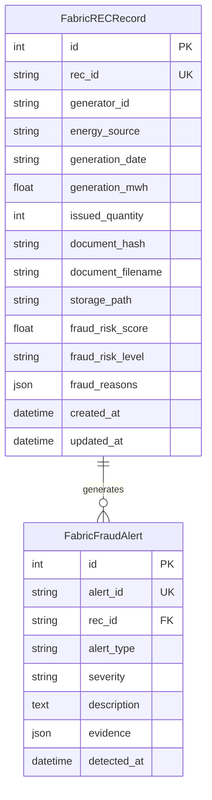

# REC Data Model Specification

This document details the data structures for on-chain state assets in Hyperledger Fabric and off-chain relational models in PostgreSQL.

---

## 1. On-Chain Data Model: `RECAsset`

The on-chain state is stored as a serialized JSON object in the Fabric World State (LevelDB/CouchDB) under the key `recId`.

```json
{
  "recId": "REC-000001",
  "generatorId": "GEN-SOLAR-01",
  "energySource": "SOLAR",
  "generationDate": "2026-09-10",
  "generationMWh": 100,
  "issuedQuantity": 100,
  "currentOwner": "ISSUER-ORG",
  "activeQuantity": 100,
  "retiredQuantity": 0,
  "status": "ACTIVE",
  "documentHash": "a591a6d40bf420404a011733cfb7b190d62c65bf0bcda32b57b277d9ad9f146e",
  "createdAt": "2026-09-12T19:27:25.548Z",
  "updatedAt": "2026-09-12T19:27:31.125Z",
  "balances": {
    "ISSUER-ORG": 60,
    "CORP-BUYER-A": 40
  }
}
```

### 1.1 Field Definitions

| Field | Type | Description |
| :--- | :--- | :--- |
| `recId` | `string` | Unique immutable primary key (e.g., `REC-000001`). |
| `generatorId` | `string` | Power generation facility identifier (e.g., `GEN-001`). |
| `energySource` | `string` | Fuel technology type: `SOLAR`, `WIND`, `HYDRO`, `BIOMASS`. |
| `generationDate` | `string` | Generation vintage period (`YYYY-MM-DD`). |
| `generationMWh` | `number` | Total megawatt-hours of verified clean electricity. |
| `issuedQuantity` | `number` | Total certificate units minted (1 REC = 1 MWh). |
| `currentOwner` | `string` | Primary custodian or latest transferring participant account. |
| `activeQuantity` | `number` | Available active units eligible for market trading or retirement. |
| `retiredQuantity`| `number` | Units permanently redeemed for carbon accounting / Scope 2. |
| `status` | `string` | State flag: `ACTIVE`, `RETIRED`, `CANCELLED`. |
| `documentHash` | `string` | 64-character SHA-256 cryptographic digest of proof document. |
| `createdAt` | `string` | ISO-8601 creation timestamp recorded by peer transaction proposal. |
| `updatedAt` | `string` | ISO-8601 timestamp of most recent state modification. |
| `balances` | `object` | Key-value mapping of `{ [ownerAccount]: quantity }` maintaining sub-allocations. |

### 1.2 Invariant Conservation Laws
1. $\text{activeQuantity} + \text{retiredQuantity} \equiv \text{issuedQuantity}$
2. $\sum_{\text{owner}} \text{balances}[\text{owner}] \equiv \text{activeQuantity}$
3. For all owners: $\text{balances}[\text{owner}] \ge 0$
4. If $\text{status} == \text{"CANCELLED"}$, no balance transfers or retirements are permitted.
5. If $\text{activeQuantity} == 0$, status is irrevocably $\text{"RETIRED"}$.

---

## 2. Off-Chain Relational Data Model (PostgreSQL)

Located in `backend/app/models/fabric_rec.py`.



### 2.1 Table: `fabric_rec_records`
Maintains off-chain index of all issued RECs, storing file paths to off-chain documents and caching forensic fraud scores computed by the Fraud Detection Engine.

### 2.2 Table: `fabric_fraud_alerts`
Stores real-time forensic detection events (e.g. duplicate document hashes, suspicious transfer velocity, circular trading patterns).
