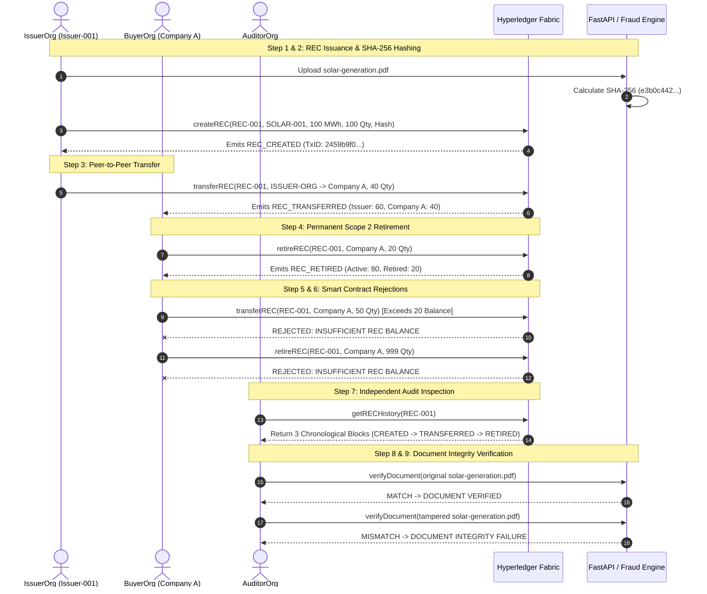

# Demonstration Guide & Prototype Validation

This guide provides a step-by-step walkthrough of the official **9-Step Demonstration Scenario** specified in Section 26 of the project requirements.

---

## 1. Prerequisites & Quick Start

Ensure the Hyperledger Fabric network and applications are running:
```bash
# 1. Start Fabric Network (Orderer, 4 Peers, Chaincode, Gateway)
cd fabric-network
./network.sh startAll   # Or on Windows PowerShell: .\network.ps1 startAll

# 2. Start Backend (Terminal 2)
cd backend
source venv/bin/activate  # Or on Windows: .\venv\Scripts\activate
uvicorn app.main:app --reload --port 8000

# 3. Start Frontend (Terminal 3)
cd frontend
npm run dev
```

Open `http://localhost:3000` in your web browser and click on the **⚡ Hyperledger Fabric DLT & Demo** tab.

---

## 2. The Official 9-Step Demo Scenario Walkthrough



---

### Step 1: Issuer Logs in & Issues Certificate
* **Action**:
  * Issuer uploads `solar-generation.pdf`.
  * The backend computes the SHA-256 hash.
  * Submits `createREC` proposal to Hyperledger Fabric with `IssuerOrgMSP` identity.
* **Payload**:
  * `recId`: `REC-001`
  * `generatorId`: `SOLAR-001`
  * `energySource`: `SOLAR`
  * `generationDate`: `2026-09-10`
  * `generationMWh`: `100`
  * `issuedQuantity`: `100`
  * `documentHash`: `e3b0c442...`

### Step 2: Confirmation & Transaction ID
* **Verification**:
  * Fabric endorses proposal across majority peers and commits block.
  * Status: `ACTIVE`.
  * Emits event: `REC_CREATED`.
  * Live Transaction ID displayed in terminal and UI.

### Step 3: Transfer 40 Units to Company A
* **Action**:
  * Transfers 40 units from `ISSUER-ORG` to `Company A`.
* **State Result**:
  * `ISSUER-ORG`: 60 active RECs.
  * `Company A`: 40 active RECs.
  * Emits event: `REC_TRANSFERRED`.

### Step 4: Company A Retires 20 Units
* **Action**:
  * `Company A` executes `retireREC` for 20 units with reason: `Scope 2 Net-Zero Goal 2026`.
* **State Result**:
  * `activeQuantity`: 80
  * `retiredQuantity`: 20
  * `Company A` balance: 20 active RECs.
  * Emits event: `REC_RETIRED`.

### Step 5: Attempt Invalid Operation (Insufficient Balance)
* **Action**:
  * `Company A` attempts to transfer 50 units (only owns 20 active units).
* **Expected Result**:
  * Smart contract rejects transaction during endorsement.
  * Error displayed: `TRANSACTION REJECTED: INSUFFICIENT REC BALANCE`.

### Step 6: Attempt Invalid Operation (Retired Quantity Reuse)
* **Action**:
  * Participant attempts to retire or transfer non-existent or previously retired units.
* **Expected Result**:
  * Smart contract rejects transaction.

### Step 7: Auditor Inspects Complete Blockchain History
* **Action**:
  * Auditor queries `getRECHistory(REC-001)`.
* **Expected Result**:
  * Complete chronological ledger timeline displayed:
    1. Block 1: `REC_CREATED` (100 units issued to ISSUER-ORG)
    2. Block 2: `REC_TRANSFERRED` (40 units moved to Company A)
    3. Block 3: `REC_RETIRED` (20 units retired for Scope 2 offset)

### Step 8: Upload Original Document (Matching Hash)
* **Action**:
  * Re-upload original `solar-generation.pdf`.
* **Expected Result**:
  * SHA-256 byte comparison matches on-chain hash.
  * Display: **`DOCUMENT VERIFIED`**.

### Step 9: Upload Altered Document (Tampered Bytes)
* **Action**:
  * Modify a single byte or sentence in the PDF and re-upload.
* **Expected Result**:
  * SHA-256 hash completely diverges from the on-chain fingerprint.
  * Display: **`DOCUMENT INTEGRITY FAILURE`**.

---

## 3. Prototype Limitations (Section 32)

This system is an academic and hackathon prototype designed to demonstrate permissioned DLT architecture and cryptographic tamper-detection.

1. **Local Fabric Network**:
   * Uses Docker Desktop on a single developer machine with local network bridge `rec_network`. Production deployment requires multi-host Kubernetes / Fabric Operator orchestration.
2. **Development Ordering Service**:
   * Employs a single Raft ordering node (`orderer.rec.com:7050`). Production enterprise networks deploy a multi-node Raft cluster (minimum 3–5 orderers across distinct cloud availability zones).
3. **Synthetic REC Data**:
   * Energy generation values and facility profiles are synthetic test records.
4. **No Direct National Registry Integration**:
   * Does not connect directly to government registries (e.g. APX, PJM-GATS, WREGIS).
5. **No Legal Certification of Uploaded Documents**:
   * Document hash matching proves strictly **byte-level cryptographic integrity** against previously registered files; it does not constitute government notarization or statutory legal certification.
6. **Development TLS & Certificates**:
   * X.509 certificates and keys are generated using `cryptogen` for local testing. Production requires enterprise Hardware Security Modules (HSMs) and production Fabric CAs.
