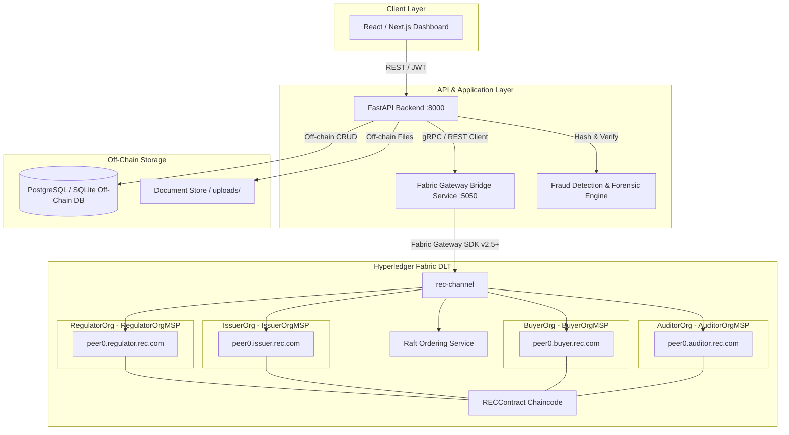

# Hyperledger Fabric Implementation Plan: REC Fraud Detection & Tracking System

## 1. Repository Inspection & Current Architecture Analysis

Prior to modifying or writing code, a comprehensive architectural inspection of the existing codebase was conducted:

| Aspect | Current Implementation in Repository | Notes / Gaps for DLT |
| :--- | :--- | :--- |
| **Frontend** | Next.js 14+ / React 18, TypeScript, Tailwind CSS (`frontend/src`). Rich single-page dashboard (`app/page.tsx`) with tabs for Dashboard, Plants & Meters, Claims & Risk, Investigations, Certificates, Ledger, Lineage Trace. | Ledger tab currently queries simulated block endpoints (`/ledger/blocks`, `/ledger/verify`). Needs real Fabric ledger view, transaction history timeline, and verification UI. |
| **Backend** | FastAPI (Python 3.12, `backend/app/main.py`), SQLAlchemy ORM, Uvicorn, LangGraph/LangChain agents. | Relies on `app/engines/ledger_engine.py` simulating a hash-chain in a relational DB (`ledger_blocks`). Needs real Fabric Gateway integration. |
| **Database** | SQLite by default (`sqlite:///./rec_guardian.db`), supports PostgreSQL via `DATABASE_URL`. Tables: `users`, `plants`, `meter_readings`, `certificate_claims`, `document_evidence`, `certificates`, `certificate_transfers`, `investigation_cases`, `ledger_blocks`. | Will retain PostgreSQL for off-chain storage (user profiles, raw documents, forensic graph data, ML model weights, case management). |
| **Authentication** | OAuth2 Password Bearer with JWT (`app/core/security.py`). User roles: `GENERATOR`, `REGULATOR`, `AUDITOR`, `ADMIN`. | Application-level RBAC only. Needs mapping to Fabric MSP identities (`IssuerOrgMSP`, `BuyerOrgMSP`, `RegulatorOrgMSP`, `AuditorOrgMSP`) for cryptographic authorization. |
| **REC Models & APIs** | `Certificate` & `CertificateTransfer` models (`app/models/certificate.py`). Endpoints under `/api/v1/certificates` and `/api/v1/claims`. | Current transfers and issuances commit to SQL and call simulated `LedgerEngine.record_event`. Needs on-chain transaction execution via Fabric. |
| **Docker Status** | None. No Dockerfile or docker-compose files currently exist. | Need Docker Compose manifests for Fabric CA, Orderer, 4 Peers, CLI, Fabric Gateway, Backend, and PostgreSQL. |
| **Fabric Status** | Fabric is not installed or configured. | Need complete Fabric 2.5 LTS setup with channel `rec-channel`, crypto material generation, chaincode packaging, and deployment scripts. |

---

## 2. Proposed Architecture



### Separation of Concerns: On-Chain vs. Off-Chain
* **On-Chain (Hyperledger Fabric)**:
  * REC lifecycle state (`ACTIVE`, `RETIRED`, `CANCELLED`).
  * Balance and quantities (`issuedQuantity`, `activeQuantity`, `retiredQuantity`).
  * Ownership and transfer history.
  * Off-chain document SHA-256 hashes (cryptographic fingerprinting).
  * Immutable events (`REC_CREATED`, `REC_TRANSFERRED`, `REC_RETIRED`, `REC_CANCELLED`).
* **Off-Chain (PostgreSQL / FastAPI)**:
  * Full user profiles, passwords, contact info.
  * Plant physical metadata, location coordinates, meter time-series readings.
  * Raw PDF documents / evidence files.
  * AI/ML fraud scores, Isolation Forest features, NetworkX graph topologies.
  * Regulatory case files, investigator notes.

---

## 3. Fabric Network & Organization Design

### Four Logical Organizations & MSPs
1. **RegulatorOrg (`RegulatorOrgMSP`)**:
   * Peer: `peer0.regulator.rec.com:7051`
   * CA: `ca.regulator.rec.com:7054`
   * Role: Regulatory oversight, cancel REC for fraud, regulatory audit, full query access.
2. **IssuerOrg (`IssuerOrgMSP`)**:
   * Peer: `peer0.issuer.rec.com:8051`
   * CA: `ca.issuer.rec.com:8054`
   * Role: Register verified generation data, execute `createREC()`, cancel faulty issuance, transfer.
3. **BuyerOrg (`BuyerOrgMSP`)**:
   * Peer: `peer0.buyer.rec.com:9051`
   * CA: `ca.buyer.rec.com:9054`
   * Role: Receive RECs, execute `transferREC()`, execute `retireREC()`. Forbidden from issuing RECs.
4. **AuditorOrg (`AuditorOrgMSP`)**:
   * Peer: `peer0.auditor.rec.com:10051`
   * CA: `ca.auditor.rec.com:10054`
   * Role: Independent verification, read-only queries, ledger integrity validation, document hash audits.
5. **OrdererOrg (`OrdererMSP`)**:
   * Orderer: `orderer.rec.com:7050` (Solo Raft for dev/prototype; extensible to multi-node Raft in production).

### Channel Configuration
* Channel Name: `rec-channel`
* Endorsement Policy: Major operations (e.g. `createREC`, `cancelREC`) require endorsement by `IssuerOrgMSP` or `RegulatorOrgMSP`; transfers and retirements endorsed by current owner MSP and peers.

---

## 4. Chaincode Design (`RECContract`)

Implemented in TypeScript using `fabric-contract-api`.

### On-Chain Asset Data Model
```typescript
export interface RECAsset {
  recId: string;                    // e.g. "REC-000001"
  generatorId: string;              // e.g. "GEN-001"
  energySource: "SOLAR" | "WIND" | "HYDRO" | "BIOMASS";
  generationDate: string;           // YYYY-MM-DD
  generationMWh: number;            // e.g. 100.0
  issuedQuantity: number;           // e.g. 100
  currentOwner: string;             // Owner client identity / MSP (e.g. "ISSUER-001" or ClientID)
  activeQuantity: number;           // Transferable/retirable balance
  retiredQuantity: number;          // Permanently taken out of circulation
  status: "ACTIVE" | "RETIRED" | "CANCELLED";
  documentHash: string;             // SHA-256 fingerprint of generation proof
  createdAt: string;                // ISO timestamp
  updatedAt: string;                // ISO timestamp
}
```

### Smart Contract Transactions
| Function | Required Caller MSP | Pre-Condition Checks | State Update & Event |
| :--- | :--- | :--- | :--- |
| `createREC(...)` | `IssuerOrgMSP` | - Caller is IssuerOrg<br>- `recId` does not exist<br>- `quantity > 0`<br>- `documentHash` valid SHA-256 (64 hex) | Writes asset with `status: ACTIVE`, `activeQuantity = quantity`, `retiredQuantity = 0`. Emits `REC_CREATED`. |
| `transferREC(...)` | Owner / `IssuerOrgMSP` / `BuyerOrgMSP` | - REC exists & is `ACTIVE`<br>- Caller owns the REC<br>- `quantity > 0`<br>- `activeQuantity >= quantity` | Deducts from sender, creates/updates recipient allocation or transfers ownership. Emits `REC_TRANSFERRED`. |
| `retireREC(...)` | Owner / `BuyerOrgMSP` | - REC exists & `status != CANCELLED`<br>- Caller is owner<br>- `activeQuantity >= quantity`<br>- `quantity > 0` | `activeQuantity -= quantity`, `retiredQuantity += quantity`. If `activeQuantity == 0`, status becomes `RETIRED`. Emits `REC_RETIRED`. Retired RECs can never be reactivated. |
| `cancelREC(...)` | `RegulatorOrgMSP` or `IssuerOrgMSP` | - Caller is Regulator or Issuer<br>- REC exists | Sets `status = CANCELLED`. Emits `REC_CANCELLED`. Cancelled RECs cannot be transferred or retired. |
| `getREC(recId)` | Any authorized MSP | REC exists | Returns current on-chain state JSON. |
| `getRECHistory(recId)` | Any authorized MSP | REC exists | Uses `ctx.stub.getHistoryForKey(recId)` to return full chronological modification trace. |
| `getTransactionHistory(recId)` | Any authorized MSP | REC exists | Returns parsed structured history including TxId, timestamp, MSP, changes, and document hashes. |
| `verifyREC(recId)` | Any authorized MSP | - | Checks state consistency, non-cancellation, active vs retired totals, and returns status report. |

---

## 5. Files to Create and Modify

### Files to Create
```
fabric-network/
├── configtx.yaml                        # Channel & MSP configuration
├── docker-compose-network.yaml          # 4 Peer nodes, 1 Orderer, 4 CAs
├── network.sh                           # Bash script to generate crypto, up, channel, deploy
├── network.ps1                          # PowerShell native runner for Windows
├── organizations/                       # Cryptogen / CA config templates
├── chaincode/
│   └── rec-contract/
│       ├── package.json
│       ├── tsconfig.json
│       └── src/
│           ├── index.ts
│           ├── recContract.ts
│           └── recAsset.ts
├── application/
│   └── fabric-gateway/
│       ├── package.json
│       ├── tsconfig.json
│       ├── src/
│       │   ├── server.ts                # Express / gRPC Gateway bridge service
│       │   ├── gatewayClient.ts         # @hyperledger/fabric-gateway connector
│       │   └── recService.ts            # Typed transaction invoker & queries
│       └── Dockerfile

docs/
├── fabric-implementation-plan.md        # This implementation plan
├── architecture.md                      # Architecture deep dive
├── fabric-network.md                    # Network setup & topology
├── chaincode.md                         # Smart contract specification
├── data-model.md                        # On-chain vs off-chain schema
├── security.md                          # Cryptographic identity & security policies
├── api.md                               # REST endpoints & payload reference
├── fraud-detection.md                   # Fraud rules & on-chain evidence
└── demo.md                              # Step-by-step walkthrough matching demo scenario
```

### Files to Modify
* `backend/app/config.py`: Add `FABRIC_GATEWAY_URL` and Fabric configuration settings.
* `backend/app/api/v1/__init__.py`: Register new `/api/rec` router alongside existing routers.
* `backend/app/api/v1/rec.py`: Implement required REST endpoints (`POST /api/rec`, `/transfer`, `/retire`, `/cancel`, `/verify`, `verify-document`, `/history`).
* `backend/app/engines/ledger_engine.py`: Integrate with Fabric service while maintaining fallback/audit capabilities.
* `backend/app/services/document_hash.py`: Compute and verify SHA-256 for documents against ledger state.
* `backend/app/engines/rule_engine.py`: Query ledger data to detect duplicate hashes, retired REC reuse, and invalid transfers.
* `frontend/src/services/api.ts`: Add methods for the new Fabric REC endpoints.
* `frontend/src/app/page.tsx` & components: Add Fabric REC ledger timeline, transaction inspector, and verification panels.
* `docker-compose.yml`: Root compose file orchestrating Fabric network, Gateway bridge, Backend, and Frontend.

---

## 6. API Layer Integration

The required REST endpoints:
* `POST /api/rec`: Create new REC on-chain (IssuerOrg).
* `POST /api/rec/{recId}/transfer`: Transfer REC units to new owner.
* `POST /api/rec/{recId}/retire`: Retire REC units for carbon accounting.
* `POST /api/rec/{recId}/cancel`: Cancel fraudulent/invalid REC (RegulatorOrg).
* `GET /api/rec/{recId}`: Fetch on-chain REC details.
* `GET /api/rec/{recId}/history`: Fetch full block-by-block ledger history.
* `GET /api/rec/{recId}/verify`: Run integrity check on REC state.
* `POST /api/documents/upload`: Calculate SHA-256 and store document off-chain.
* `POST /api/rec/{recId}/verify-document`: Re-hash uploaded document and match against ledger `documentHash`.
* `GET /api/fraud/alerts`: List fraud alerts (double-counting, hash collision, unauthorized transfer).

---

## 7. Implementation Phases

Follow strictly the 15-phase sequence:
* **Phase 1**: Fabric Development Network Scaffolding (Docker compose, configtx, crypto material generation).
* **Phase 2**: Four Organizations & CA Identities (`RegulatorOrg`, `IssuerOrg`, `BuyerOrg`, `AuditorOrg`).
* **Phase 3**: REC Chaincode Implementation (`RECContract` with strict MSP checks).
* **Phase 4**: `createREC` Transaction & Unit Tests.
* **Phase 5**: `transferREC` Transaction & Balance Verification.
* **Phase 6**: `retireREC` Transaction & Non-Reactivation Enforcement.
* **Phase 7**: `cancelREC` Transaction & Authorization Constraints.
* **Phase 8**: History & Audit Queries (`getRECHistory`, `getTransactionHistory`).
* **Phase 9**: Document Hashing & Off-Chain Evidence Verification.
* **Phase 10**: Fabric Gateway Bridge Service (`@hyperledger/fabric-gateway`).
* **Phase 11**: FastAPI Integration (REST API endpoints connecting to Fabric Gateway).
* **Phase 12**: Fraud Detection Integration (Consuming ledger history into Risk Fusion Engine).
* **Phase 13**: React / Next.js UI Dashboard Updates.
* **Phase 14**: Automated Test Suite (16 required test cases covering all edge and fraud scenarios).
* **Phase 15**: Documentation & Demo Verification.

---

## 8. Testing Strategy

16 Automated Tests verifying business rules and tamper-resistance:
1. `test_create_rec_success`: Valid creation by IssuerOrg.
2. `test_create_rec_duplicate_id`: Duplicate `recId` rejected.
3. `test_create_rec_invalid_quantity`: Zero or negative quantity rejected.
4. `test_create_rec_unauthorized`: Non-issuer role rejected.
5. `test_transfer_rec_success`: Valid transfer deducts and credits correctly.
6. `test_transfer_rec_insufficient_balance`: Transfer greater than active balance rejected.
7. `test_transfer_rec_unauthorized`: Transfer by non-owner rejected.
8. `test_retire_rec_success`: Valid retirement updates `active` and `retired` quantities.
9. `test_retire_rec_insufficient_balance`: Retiring more than owned rejected.
10. `test_transfer_retired_rec_failure`: Attempting to transfer retired units rejected.
11. `test_cancel_rec_success`: Regulator/Issuer cancels REC.
12. `test_transfer_cancelled_rec_failure`: Transfer of cancelled REC rejected.
13. `test_duplicate_document_hash_detection`: Detecting reuse of same proof document across RECs.
14. `test_rec_history_immutability`: Chronological lineage verification from creation to retirement.
15. `test_authorization_by_msp`: Strict enforcement of organization capabilities.
16. `test_ledger_query_verification`: Verification endpoint correctly confirms validity.
