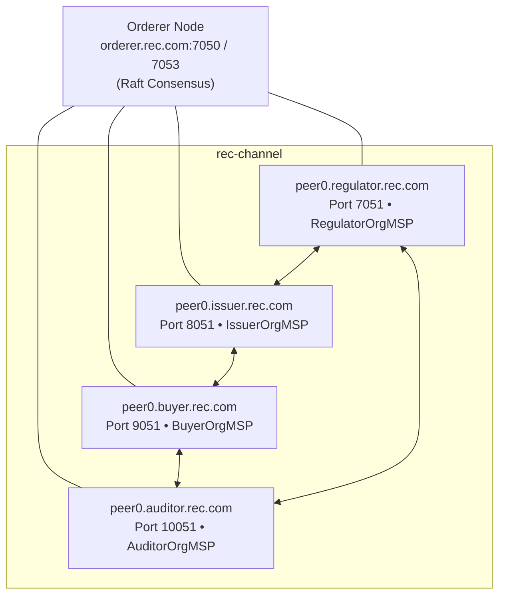

# Hyperledger Fabric Network Specification

This document details the configuration, network topology, cryptographic foundations, and deployment architecture of the local Hyperledger Fabric v2.5 development network.

---

## 1. Network Topology

The network consists of **four distinct peer organizations** and **one ordering organization**, operating on the dedicated channel `rec-channel`.



---

## 2. Organization Roles & Capabilities

| Organization | MSP ID | Primary Responsibilities | Node Endpoints |
| :--- | :--- | :--- | :--- |
| **RegulatorOrg** | `RegulatorOrgMSP` | Market surveillance, fraud alerts investigation, regulatory directives, certificate cancellation / revocation. | `peer0.regulator.rec.com:7051` |
| **IssuerOrg** | `IssuerOrgMSP` | Generator facility onboarding, telemetry validation, certificate issuance (`createREC`), initial distribution. | `peer0.issuer.rec.com:8051` |
| **BuyerOrg** | `BuyerOrgMSP` | Purchasing RECs, holding active inventory, certificate retirement (`retireREC`) for Scope 2 compliance. | `peer0.buyer.rec.com:9051` |
| **AuditorOrg** | `AuditorOrgMSP` | Independent ESG auditing, reading ledger state, verifying document hashes, querying transaction block history. | `peer0.auditor.rec.com:10051` |
| **OrdererOrg** | `OrdererMSP` | Crash fault-tolerant (Raft) ordering, batching transactions into blocks, distributing blocks to peers. | `orderer.rec.com:7050` (Admin: `7053`) |

---

## 3. Consensus & Endorsement Policies

1. **Ordering Service**:
   * Single-node Raft ordering cluster running Fabric Orderer v2.5.9.
   * Batch timeout: `2s`.
   * Max message count per block: `10`.
   * Absolute max bytes: `99 MB`.
2. **Endorsement Policy**:
   * Channel lifecycle endorsement: `MAJORITY Endorsement` (requires endorsement signatures from at least 3 of the 4 peer organizations).
   * Chaincode endorsement policy: `OutOf(3, 'RegulatorOrgMSP.peer', 'IssuerOrgMSP.peer', 'BuyerOrgMSP.peer', 'AuditorOrgMSP.peer')`.
   * Ensures that no single entity (or two colluding entities) can execute unauthorized state mutations without cross-organizational cryptographic consensus.

---

## 4. Chaincode as a Service (CCAAS) Architecture

Rather than mounting the Docker socket inside peer containers (which is prone to Windows container engine pipe breakages), this project deploys chaincode via the **Fabric Chaincode as a Service (CCAAS)** protocol:
* **Container**: `rec-contract:1.0`
* **Address**: `rec-contract:9999`
* **Protocol**: Fabric Chaincode External Service
* When peers execute transactions, they communicate with `rec-contract:9999` over Docker network `rec_network`.

---

## 5. Network Lifecycle Scripts

The root network scripts `fabric-network/network.sh` (Linux/macOS/Git Bash) and `fabric-network/network.ps1` (Windows PowerShell) control all operations:

```bash
# 1. Bring up containers (Orderer, 4 Peers, CLI)
./network.sh up

# 2. Create rec-channel and join all 4 organizations
./network.sh createChannel

# 3. Package, install on all 4 peers, approve, and commit chaincode
./network.sh deployCC

# 4. Start the Node.js Fabric Gateway bridge service on port 5050
./network.sh startGateway

# 5. One-shot command to run entire network pipeline
./network.sh startAll

# 6. Tear down all containers and clean network
./network.sh down
```
