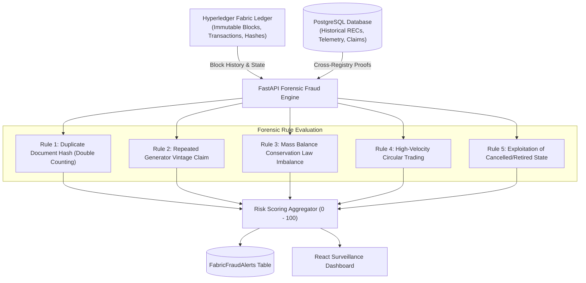

# Forensic Fraud Detection Engine Specification

This document details the multi-engine forensic fraud detection architecture, cross-referencing on-chain distributed ledger states, transaction histories, and off-chain telemetry records.

---

## 1. Why AI/ML & Complex Fraud Models Stay Off-Chain

Smart contracts on Hyperledger Fabric must execute **strictly deterministically** across all endorsing peers. Every peer that executes a transaction proposal must arrive at the exact same read-write set down to the bit.

* Non-deterministic elements (floating-point neural network inference, asynchronous external API queries, time-of-day variations) cause **endorsement policy mismatch** and transaction rejection.
* Heavy computational tasks (deep learning, large graph cycle traversal) cause latency bottlenecks in consensus.
* **Solution**: The Fraud Detection Engine operates in the **FastAPI layer**, consuming immutable transaction blocks from Fabric, cross-referencing off-chain databases, and recording high-severity alerts.

---

## 2. Core Forensic Rules & Heuristics

### 2.1 Rule 1: Duplicate Document Hash (Double Counting)
* **Threat**: A rogue generator uploads the exact same generation proof PDF to mint multiple distinct certificates under different IDs or dates.
* **Detection**: Queries `fabric_rec_records` for any existing REC with the same `document_hash` where `rec_id != current_rec_id`.
* **Impact**: Adds **+85.0 points** to risk score $\rightarrow$ triggers `CRITICAL` severity alert `DUPLICATE_DOCUMENT_HASH`.

### 2.2 Rule 2: Repeated Generation Period Claim
* **Threat**: A solar farm claims 100 MWh for September 2026, and later submits a second claim for the exact same facility on the same generation date.
* **Detection**: Checks if `(generator_id, generation_date)` has already been committed to the registry.
* **Impact**: Adds **+40.0 points** to risk score $\rightarrow$ triggers `HIGH` severity alert `DUPLICATE_GENERATION_CLAIM`.

### 2.3 Rule 3: Mass Balance Conservation Law Imbalance
* **Threat**: Synthetically inflating certificate units during transfers or balance allocations.
* **Detection**: Validates:
$$\text{activeQuantity} + \text{retiredQuantity} \equiv \text{issuedQuantity}$$
$$\sum_{\text{participants}} \text{balances}[\text{participant}] \equiv \text{activeQuantity}$$
* **Impact**: Adds **+35.0 points** to risk score $\rightarrow$ triggers `HIGH` severity alert `QUANTITY_INCONSISTENCY`.

### 2.4 Rule 4: High Transaction Velocity & Wash Trading
* **Threat**: Artificial trading volume generated by rapidly transferring RECs back and forth between colluding entities.
* **Detection**: Analyzes the chronological transaction block history from `getRECHistory`. If more than 5 transfers occur in rapid succession or exhibit cyclical owner patterns (`A -> B -> A`), an alert is flagged.
* **Impact**: Adds **+15.0 points** to risk score.

### 2.5 Rule 5: Exploitation of Cancelled / Voided RECs
* **Threat**: Attempting to transfer, market, or retire certificates that have been cancelled by regulatory directive.
* **Detection**: Checks status on ledger. If `CANCELLED`, flag immediately.
* **Impact**: Adds **+20.0 points** to risk score.

---

## 3. Risk Level Scoring Framework

The composite risk score $S \in [0.0, 100.0]$ maps to regulatory triage tiers:

| Score Range | Risk Level | Action Directive |
| :--- | :--- | :--- |
| **0.0 – 34.9** | `LOW` | Automatically approved for trading and settlement. |
| **35.0 – 69.9** | `MEDIUM` | Flagged for manual review by issuing body before retirement. |
| **70.0 – 100.0** | `HIGH` / `CRITICAL` | Suspended; automated alert dispatched to RegulatorOrg for investigation. |
