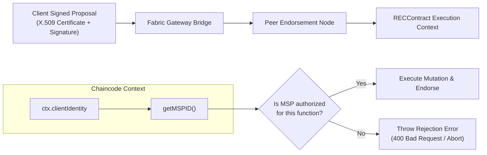

# Security & Access Control Specification

This document details the security architecture, identity federation, cryptographic enforcement, and threat mitigation mechanisms of the REC Fraud Detection & Tracking System.

---

## 1. Fabric MSP Identity & Authorization

In enterprise distributed ledgers, access control **must never rely solely on frontend or API checks**. The smart contract execution environment itself validates identity credentials.

### 1.1 Organizational Authorization Matrix

| Chaincode Function | Authorized MSP(s) | Unauthorized MSPs | Enforcement Mechanism |
| :--- | :--- | :--- | :--- |
| `createREC` | `IssuerOrgMSP` | `BuyerOrgMSP`, `AuditorOrgMSP`, `RegulatorOrgMSP` | In-contract check: `ctx.clientIdentity.getMSPID() === 'IssuerOrgMSP'` |
| `transferREC` | Authorized Account Holder | Non-holders, Unapproved Third Parties | In-contract balance check: `balances[fromOwner] >= quantity` |
| `retireREC` | Authorized Unit Owner | Non-owners, Third Parties | In-contract balance check: `balances[owner] >= quantity` |
| `cancelREC` | `RegulatorOrgMSP`, `IssuerOrgMSP` | `BuyerOrgMSP`, `AuditorOrgMSP` | In-contract check: `getMSPID() in ['RegulatorOrgMSP', 'IssuerOrgMSP']` |
| `getREC` | All 4 Organizations | Non-network entities | Channel read access policy |
| `getRECHistory`| All 4 Organizations | Non-network entities | Channel read access policy |
| `verifyREC` | All 4 Organizations | Non-network entities | Channel read access policy |

---

## 2. Cryptographic Document Protection

### 2.1 Why Documents Stay Off-Chain
* Storing large binary files (PDFs, TIFF scans) on blockchain causes state bloat, degrades peer gossip latency, and violates privacy regulations (such as GDPR or commercial confidentiality).
* The REC system computes a **SHA-256 cryptographic digest** of the raw document file bytes:
$$\text{documentHash} = \text{SHA256}(\text{document\_bytes})$$
* This 64-character hexadecimal string is written directly to the ledger during `createREC`.

### 2.2 Tamper Detection Mechanism
* When any party re-uploads a document for verification:
  1. The backend recalculates $\text{SHA256}(\text{uploaded\_bytes})$.
  2. The backend retrieves the original `documentHash` committed to Hyperledger Fabric.
  3. If even a single byte has changed, the hash diverges completely (avalanche effect).
  4. The system flags `DOCUMENT INTEGRITY FAILURE`.

---

## 3. Threat Modeling & Countermeasures

| Threat Scenario | Attack Vector | Countermeasure |
| :--- | :--- | :--- |
| **Double Issuance** | Generator attempts to mint RECs twice for the same vintage. | Off-chain DB uniqueness check + on-chain `recId` existence check + duplicate document hash check in fraud engine. |
| **Over-Transfer** | Buyer attempts to sell more RECs than held in inventory. | Smart contract balance enforcement rejects with `INSUFFICIENT REC BALANCE`. |
| **Resale of Retired RECs** | Participant attempts to transfer units that were retired for Scope 2 offset. | Retired units decrement `activeQuantity` and are credited to `retiredQuantity`. Smart contracts strictly restrict transfer to `activeQuantity`. |
| **Revocation Bypass** | Trader attempts to liquidate a cancelled certificate. | Smart contract verifies `status !== "CANCELLED"` prior to allowing any transfer. |
| **Rogue Issuance** | Compromised buyer key attempts to mint synthetic certificates. | Smart contract asserts caller MSP is `IssuerOrgMSP`; any proposal from `BuyerOrgMSP` is rejected during peer endorsement. |
| **Data Alteration** | Central database admin attempts to modify past certificate ownership. | Fabric transactions are cryptographically chained in blocks signed by the ordering service and all endorsing peers; historical modifications are impossible. |

---

## 4. Secrets & Credential Management Policy

1. **Zero Hardcoded Secrets**: All configuration values are injected via environment variables (`.env`).
2. **Exclusion from Version Control**: `.gitignore` strictly excludes:
   * Private keys (`*.key`, `keystore/`)
   * Digital certificates (`*.pem`, `*.crt`)
   * Uploaded documents (`uploads/`)
   * SQLite databases (`*.db`)
3. **Template Provided**: `.env.example` provides explicit setup parameters without leaking sensitive operational credentials.
